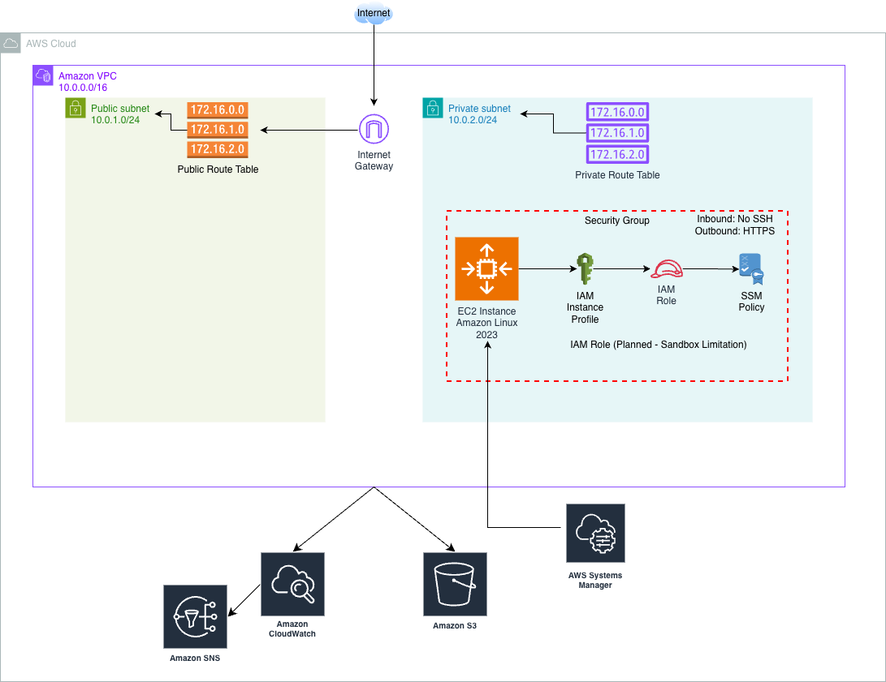

# AWS Cloud Engineering Portfolio Project
Secure, automated, and reproducible AWS infrastructure built with Terraform, GitHub Actions, and AWS CloudWatch following the AWS Well-Architected Framework.

---

## Project at a Glance

| Category | Implementation |
|---|---|
| Cloud Provider | Amazon Web Services (AWS) |
| Infrastructure as Code | Terraform |
| Compute | Amazon EC2 |
| Networking | Amazon VPC, Public/Private Subnets, Route Tables |
| Storage | Amazon S3 with Server-Side Encryption |
| Monitoring | Amazon CloudWatch, CloudWatch Logs, CloudWatch Alarms |
| Notifications | Amazon SNS |
| CI/CD | GitHub Actions |
| Architecture Principles | AWS Well-Architected Framework |
| Security Focus | Least Privilege, Network Segmentation, Encryption |

---

## Project Overview

This project demonstrates the design and implementation of a secure, automated, modular, and reproducible cloud infrastructure on Amazon Web Services (AWS) using Infrastructure as Code (IaC) with Terraform. The solution addresses common cloud engineering challenges by automating infrastructure deployment, implementing operational monitoring, and validating infrastructure changes through a GitHub Actions CI/CD workflow.  

The architecture provisions AWS networking, compute, monitoring, and storage resources while emphasizing automation, security, maintainability, and repeatability.  Throughout development, design decisions were guided by the AWS Well-Architected Framework and adapted where needed to accommodate AWS Academy sandbox limitations without compromising architectural best practices.  

This repository contains the complete Terraform source code, technical documentation, architecture diagrams, screenshots, and implementation details for the project.

---

# Solution Architecture

<p align="center">
  
</p>

The infrastructure is organized into reusable Terraform modules:

- **Networking** - Amazon VPC, Internet Gateway, public/private subnets, route tables
- **Compute** - Amazon EC2 with least-privilege security groups
- **Monitoring** - Amazon CloudWatch Logs, Amazon CloudWatch Alarms, and Amazon Simple Notification Service (SNS)
- **Storage** - Amazon S3 with server-side encryption
- **Automation** - GitHub Actions for Terraform validation and CI/CD

## Business Problem

Small organizations often face challenges when adopting cloud infrastructure, including inconsistent manual deployments, limited operational visibility, and difficulty maintaining secure and repeatable environments.

This project addresses these challenges by designing an automated AWS environment that provides:

- Consistent infrastructure deployment through Infrastructure as Code (IaC)
- Improved security posture through network segmentation and least-privilege design
- Operational visibility through automated monitoring and alerting
- Controlled infrastructure changes through version control and automated validation

The solution was designed around two primary AWS Well-Architected Framework pillars:

- **Security** - protecting resources through controlled access, network isolation, and secure configuration practices
- **Operational Excellence** - enabling reliable operations through automation, monitoring, and repeatable processes

---

## Project Objectives

The goal of this project was to create a production-style AWS environment that demonstrates practical cloud engineering skills.

The primary objectes were:

| Objective | Implementation |
|-----------|----------------|
| Automate infrastructure deployment | Terraform modules for AWS resource provisioning |
| Create a secure network foundation | Amazon VPC with public/private subnet separation |
| Deploy cloud compute resources | Amazon EC2 infrastructure managed through Terraform |
| Implement monitoring and alerting | Amazon CloudWatch metrics, logs, alarms, and SNS notifications |
| Secure cloud storage | Amazon S3 bucket with server-side encryption |
| Validate infrastructure architecture | GitHub Actions Terraform validation workflow |
| Maintain reusable architecture | Modular Terraform structure supporting multiple environments |

## Technology Stack

This project uses a combination of cloud services, Infrastructure as Code tooling, automation workflows, and documentation tools to create a secure and repeatable AWS environment.

| Category | Technology | Purpose |
|-----------|------------|---------|
| Cloud Provider | Amazon Web Services (AWS) | Cloud infrastructure platform |
| Infrastructure as Code | Terraform | Automated provisioning and lifecycle management of AWS resources |
| Compute | Amazon EC2 | Cloud-based compute resources |
| Networking | Amazon VPC | Secure network isolation and traffic management |
| Storage | Amazon S3 | Scalable object storage with server-side encryption |
| Monitoring | Amazon CloudWatch | Metrics, logs, dashboards, and operational monitoring |
| Alerting | Amazon SNS | Automated notifications for infrastructure events |
| Source Control | GitHub | Version control and project collaboration |
| CI/CD Automation | GitHub Actions | Terraform validation and automated workflow execution |
| Architecture Design | Draw.io | Network topology and architecture diagrams |
| Development Environment | Visual Studio Code / GitHub Codespaces | Terraform development and testing environment |

---

## AWS Services Implemented

The final architecture includes the following AWS components:

### Networking
- Amazon VPC
- Internet Gateway
- Public and private subnets
- Public and private route tables
- Security groups

### Compute
- Amazon EC2 instance
- Security group configuration following least-privilege principles

### Storage
- Amazon S3 bucket
- Server-side encryption using AES-256

### Monitoring and Operations
- Amazon CloudWatch Log Group
- CloudWatch CPU utilization alarm
- CloudWatch EC2 status check alarm
- Amazon SNS notification topic

### Automation
- Terraform modules for infrastructure provisioning
- GitHub Actions workflow for Terraform validation

## Repository Structure

The repository is organized to separate infrastructure components, deployment environments, documentation, and supporting project resources.  This structure follows Terraform best practices by using reusable modules and environment-specific configurations.

```text
aws-cloud-engineering-capstone/
│
├── .github/
│   └── workflows/
│       └── terraform-validation.yml
│
├── diagrams/
│   └── aws-cloud-architecture-diagram.png
│   └── aws-cloud-architecture.drawio
├── documentation/
│   ├── AWS Cloud Engineering Capstone Project Final Report.pdf
│   └── AWS Cloud Engineering Capstone Project Proposal.pdf
│
├── screenshots/
│   ├── automation/
│   ├── compute/
│   ├── monitoring/
│   ├── networking/
│   └── storage/
│
├── terraform/
│   │
│   ├── environments/
│   │   ├── dev/
│   │   ├── prod/
│   │   └── staging/
│   │
│   ├── modules/
│       ├── compute/
│       ├── monitoring/
│       ├── network/
│       └── storage/
│
├── .gitignore
├── README.md
```

### Directory Purpose

| Directory | Purpose |
|-----------|---------|
| `.github/workflows` | Stores GitHub Actions automation workflows |
| `diagrams` | Contains architecture and network topology diagrams |
| `docs` | Contains project documentation and design materials |
| `screenshots` | Provides AWS console evidence of deployed resources |
| `terraform/modules` | Contains reusable infrastructure components |
| `terraform/environments` | Stores environment-specific Terraform configurations |
| `terraform.tfvars.example` | Provides example configuration values without sensitive information |

The modular Terraform structure allows infrastructure components to be independently maintained, tested, and reused across multiple environments while keeping resource configuration separate from environment-specific values.

## Deployment Workflow

The infrastructure deployment process is designed around Infrastructure as Code principles.  All AWS resources are defined using Terraform configuration files and deployed through a controlled workflow.

The general deployment workflow is:

```text
Developer
    |
    v
GitHub Repository
    |
    v
GitHub Actions Validation
    |
    ├── Terraform Format Check
    ├── Terraform Initialization
    └── Terraform Validation
    |
    v
Terraform Plan Review
    |
    v
Terraform Apply
    |
    v
AWS Infrastructure Deployment
```

### Terraform Deployment Process

1. Clone the repository:

```bash
git clone <https://github.com/Vukodlok/aws-cloud-engineering-capstone.git>
cd aws-cloud-engineering-capstone
```

2. Navigate to the desired environment:

```bash
cd terraform/environments/prod
```

3. Initialize Terraform:

```bash
terraform init
```

4. Validate the Terraform configuration:

```bash
terraform validate
```

5. Review the planned infrastructure changes:

```bash
terraform plan
```

6. Deploy the infrastructure:

```bash
terraform apply
```

7. Verify deployed resources:

```bash
terraform output
terraform state list
```

---

## CI/CD Validation Workflow

The repository includes a GitHub Actions workflow that automatically validates Terraform configuration changes.

The workflow performs:

- Terraform formatting checks
- Terraform initialization
- Terraform configuration validation

This ensures infrastructure changes are reviewed before deployment and reduces the risk of configuration errors reaching the deployment stage.

Because this project was developed using an AWS Academy sandbox environment, deployment execution remained a controlled manual process using temporary AWS credentials.  In a production environment, this workflow would be extended using secure AWS authentication methods such as OpenID Connect (OIDC) federation for automated Terraform deployments without long-lived credentials.

## Architecture Decisions

This project was designed using AWS Well-Architected Framework principles, with a focus on security, operational excellence, and repeatable infrastructure deployment.

The following architectural decisions were made during development.

---

### Infrastructure as Code with Terraform

Terraform was selected as the infrastructure provisioning tool because it enables consistent, repeatable, and version-controlled AWS deployments.

Benefits of this approach include:

- Reduced manual configuration errors
- Reusable infrastructure modules
- Consistent deployment across environments
- Auditable infrastructure changes through version control

The Terraform configuration is organized using reusable modules for networking, compute, monitoring, and storage.

---

### Modular Terraform Design

The project uses a modular Terraform structure to separate infrastructure components by responsibility.

Implemented modules include:

- `network` - VPC, subnets, route tables, and Internet Gateway
- `compute` - EC2 instance and security group configuration
- `monitoring` - CloudWatch logs, alarms, and SNS notifications
- `storage` - S3 bucket configuration and encryption

This structure improves maintainability and allows future expansion into additional environments such as development and staging.

---

### Network Segmentation

The architecture uses separate public and private subnets within an Amazon VPC.

The design follows defense-in-depth principles:

- Public subnet resources can communicate with external services through an Internet Gateway.
- Private subnet resources remain isolated from direct inbound internet access.
- Security groups enforce controlled network communication.

In a production environment, private workloads would typically span multiple Availability Zones to improve resilience and availability.

---

### EC2 Security Design

The EC2 instance design follows least-privilege security principles.

The implementation includes:

- No unnecessary inbound access rules
- Explicit outbound HTTPS access
- Security group rules managed through Terraform
- Infrastructure deployed through code rather than manual configuration

The original design included IAM roles and AWS Systems Manager Session Manager to provide secure administrative access without SSH keys or exposed inbound ports.

Due to AWS Academy sandbox permission restrictions, IAM role creation could not be fully implemented during deployment.  The recommended production architecture retains this design using IAM roles and temporary AWS-managed credentials.

--- 

### NAT Gateway Decision

A NAT Gateway was intentionally excluded from the final implementation.

In a production environment, a NAT Gateway would provide controlled outbound internet access for private resources while maintaining inbound isolation.  This would support activities such as:

- Operating system updates
- Package installation
- External API communication

The AWS Academy sandbox environment and project scope made the additional cost and resource requirements unnecessary for this implementation.

---

### CI/CD Tool Selection

The original design considered AWS native CI/CD including CodePipeline, CodeBuild, and CodeDeploy.

The final implementation uses GitHub Actions because it more closely reflects common industry workflow where infrastructure code is stored and validated directly from source control.

GitHub Actions provides:

- Automated Terraform validation
- Version-controlled workflows
- Integration with pull requests
- Clear audit history of infrastructure changes
For production deployment, GitHub Actions would be extended with AWS OIDC authentication to enable secure automated Terraform execution.

---

### Storage Security

Amazon S3 was implemented as the project's storage solution.

The bucket uses server-side encryption with AES-256 to protect data at rest while maintaining compatibility with the AWS sandbox environment.

Production environments may use additional controls such as:

- Customer managed KMS keys
- Bucket policies
- Object versioning
- Lifecycle policies
- Access logging

## Project Evidence

The following screenshots provide evidence of deployed AWS resources and automation workflows.  Screenshots are organized by architecture component within the repository.

---

## Networking

The networking layer establishes the foundation of the AWS environment through a dedicated VPC, subnet segmentation, and controlled routing.

Included resources:

- Amazon VPC
- Public subnet
- Private subnet
- Route table configuration

Evidence:

- [View Networking Screenshots](screenshots/networking/)

---

## Compute and Security

The compute layer demonstrates the deployment of AWS compute resources with controlled network access.

Included resources:

- Amazon EC2 instance
- Security group configuration
- Inbound and outbound traffic rules

Evidence:

- [View Compute Screenshots](screenshots/compute/)

---

## Monitoring and Alerting

The monitoring architecture provides operational visibility through AWS CloudWatch and automated notifications through Amazon SNS.

Included resources:

- CloudWatch alarms
- SNS notification topic
- SNS email subscription

Evidence:

- [View Monitoring Screenshots](screenshots/monitoring/)

---

## Storage

The storage layer demonstrates secure object storage using Amazon S3.

Included resources:

- S3 bucket deployment
- Server-side encryption configuration

Evidence:

- [View Storage Screenshots](screenshots/storage/)

---

## Infrastructure Automation

Infrastructure validation is performed through GitHub Actions to ensure Terraform configuration quality before deployment.

Included workflow checks:

- Terraform formatting validation
- Terraform initialization
- Terraform validation

Evidence:

- [View Automation Screenshots](screenshots/automation/)

## Limitations and Future Improvements

This project was developed within an AWS Academy sandbox environment.  While the sandbox provided the ability to design and deploy AWS infrastructure using Terraform, several production-level features were limited by account permissions, resource lifecycle constraints, and project scope.

The following improvements represent recommended next steps for a production implementation.

---

### Automated AWS Authentication

The original design included GitHub Actions executing Terraform deployments automatically using secure AWS authentication.

Due to AWS Academy sandbox restrictions, IAM administrative permissions required for configuring OpenID Connect (OIDC) federation were unavailable.

Future implementation:

- Configure GitHub Actions OIDC authentication with AWS IAM
- Remove dependency on long-lived AWS credentials
- Allow secure automated Terraform plan and apply workflows
- Maintain auditable infrastructure changes through source control

---

### IAM Role Integration

The original architecture included IAM roles and AWS Systems Manager Session Manager for secure EC2 administration.

The production design would include:

- IAM role attached through an EC2 instance profile
- AWS Systems Manager Session Manager access
- Temporary AWS-managed credentials
- Removal of SSH key-based administration

IAM implementation was documented in the architecture design but could not be deployed due to sandbox permission restrictions.

---

### High Availability Architecture

The current implementation uses a simplified single Availability Zone design to remain within project scope and sandbox constraints.

A production architecture would expand to include:

- Multiple Availability Zones
- Redundant public and private subnets
- Load balancing across instances
- Increased fault tolerance

---

### NAT Gateway Implementation

A NAT Gateway was excluded from the final deployment due to sandbox cost considerations and project scope.

A production implementation would include:

- NAT Gateway deployed in the public subnet
- Private subnet route configuration
- Controlled outbound internet access for private workloads

This would allow private resources to retrieve updates and communicate with external services without exposing them to inbound internet traffic.

---

### Additional Security Controls

Future security improvements could include:

- AWS Key Management Service (KMS) customer-managed encryption keys
- AWS CloudTrail auditing
- AWS Config compliance monitoring
- Enhanced IAM policies following least privilege principles
- Additional network security controls

---

### Multi-Environment Deployment

The Terraform structure was designed to support multiple environments:

- Development
- Staging
- Production

The current implementation focuses on the production environment as the demonstration deployment.  Future expansions would deploy identical infrastructure patterns across additional environments using separate variable configurations.

## Testing and Validation

Infrastructure changes were validated throughout the development process using Terraform validation workflows and AWS resource verification.

The following validation steps were performed:

---

### Terraform Configuration Validation

Terraform configuration was tested using built-in validation commands:

```bash
terraform fmt
terraform validate
terraform plan
```

These checks verified:

- Terraform syntax correctness
- Provider configuration
- Module references
- Resource dependency resolution
- Planned infrastructure changes before deployment

---

### Infrastructure Deployment Validation

After successful Terraform deployment, AWS resources were verified through both Terraform state management and the AWS Management Console.

Validation included:

- Confirming Terraform successfully created AWS resources
- Reviewing Terraform outputs
- Verifying resource configuration in AWS Console
- Capturing deployment evidence screenshots

Example Terraform verification commands:

```bash
terraform state list
terraform output
```

---

### GitHub Actions Validation

The repository includes an automated Terraform validation workflow.

The workflow performs:

- Terraform formatting checks
- Terraform initialization
- Terraform validation

This ensures infrastructure code quality before changes are merged into the main branch.

---

### Deployment Constraints

The AWS Academy sandbox environment introduced temporary resource lifecycles and restricted IAM permissions.

Because of these limitations:

- Terraform deployment execution was performed manually using temporary sandbox credentials
- Automated AWS deployment through GitHub Actions was documented as a future production enhancement
- IAM role deployment was designed but not enabled in the final sandbox deployment

These constraints were documented as architectural decisions rather than treated as deployment failures.

## Engineering Principles Applied

Throughout the design and implementation of this project, several core cloud engineering principles guided architectural decisions:

### Simplicity and Purpose-Driven Architecture

The architecture was designed to satisfy business requirements while avoiding unnecessary complexity. Resources were added based on operational need rather than simply incorporating additional services.

### Minimize Internet Exposure

Services should not be exposed to the public internet unless there is a clear business requirement. The architecture uses network segmentation, private resources, and security groups to reduce unnecessary exposure and follow defense-in-depth principles.

### Separation of Concerns

Professional infrastructure projects separate responsibilities into maintainable components. Terraform modules were organized by function, including networking, compute, monitoring, and storage, allowing individual components to be developed, tested, and maintained independently.

### Design for Extension

The Terraform structure was designed to support future growth without requiring significant redesign. Environment-specific configurations, reusable modules, and variable-driven deployments allow additional environments and resources to be added as requirements evolve.

### Define Interfaces Before Implementation

Terraform modules were designed by first identifying required inputs and expected outputs. This approach creates predictable module behavior and improves reusability across different environments.

### Reuse Proven Solutions

Infrastructure components were designed to be reusable rather than rebuilt for each environment. Terraform modules and configuration patterns allow consistent deployment while reducing duplication and configuration errors.
## Lessons Learned

This project provided practical experience designing, deploying, and troubleshooting AWS infrastructure as Code principles.

Key lessons learned included:

- Cloud architectures must account for platform constraints, permission boundaries, and operational requirements.
- Infrastructure as Code enables repeatable deployment even when cloud environments are temporary or recreated frequently.
- Git history provides an audit trail of engineering decisions, troubleshooting steps, and architectural changes throughout the development process.
- Security and operational excellence require intentional design decisions rather than relying on default configurations.
- Cloud engineering requires balancing ideal production architecture with available resources, project scope, and business requirements.

Working within AWS Academy sandbox limitations reinforced the importance of designing infrastructure that is reproducible, documented, and adaptable.

## Project Resources

Additional project documentation and resources are available in this repository:

- [Final Project Paper](documentation/aws-cloud-engineering-capstone-project-final-report.pdf)
- [Project Proposal](documentation/aws-cloud-engineering-capstone-project-proposal.pdf)
- [Architecture Diagrams](diagrams/)
- [Deployment Evidence](screenshots/)

---

## Author

**Mark Robuck**

Cloud Engineering Portfolio Project

This project demonstrates practical experience with:

- Amazon Web Services (AWS)
- Terraform Infrastructure as Code
- CloudWatch Monitoring and Alerting
- GitHub Actions CI/CD Workflows
- Cloud Security Best Practices
- AWS Well-Architected Framework Principles

Connect with me:

- [LinkedIn](https://www.linkedin.com/in/mark-robuck/)
- [Portfolio Website](https://mrmarkrobuck.wordpress.com/)
